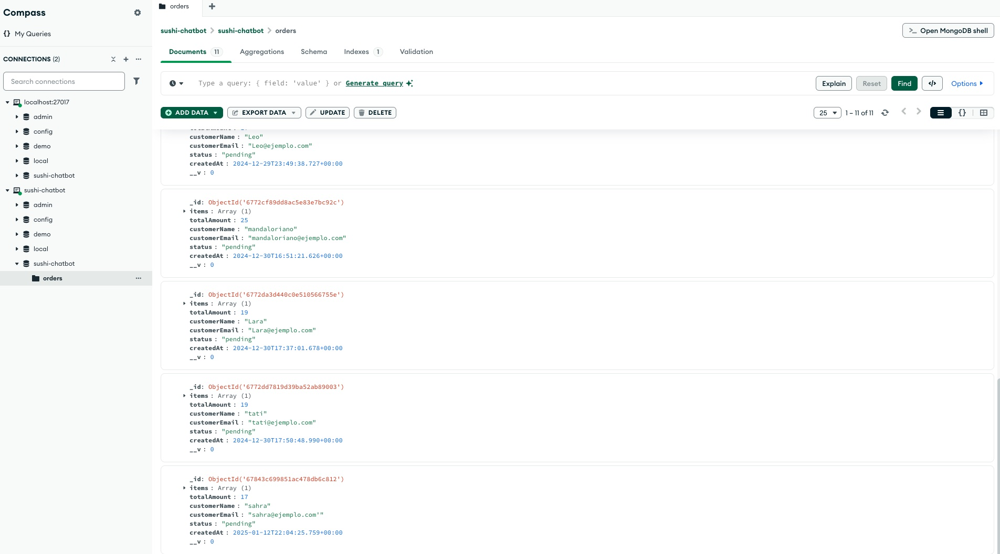

# Challenge Desarrollador Junior de Chatbots IA - Back-end: Chatbot para pedir Sushi  

¡Bienvenido/a al proyecto del **Chatbot para pedir Sushi**! Este repositorio contiene la solución al challenge de Desarrollador Junior de Chatbots IA, que consiste en crear un chatbot funcional para gestionar pedidos de sushi, mostrar un menú y responder preguntas frecuentes.  

## 🚀 Funcionalidades  

- **Mostrar el menú:** El chatbot puede mostrar el menú de sushi cuando se lo soliciten.  
- **Tomar pedidos básicos:** Permite registrar pedidos simples de los usuarios.  
- **Responder preguntas frecuentes:** Responde preguntas como "¿están abiertos?" y otras similares.  

## 🛠️ Tech Stack  

Para desarrollar este proyecto se utilizaron las siguientes tecnologías:  

- **Node.js:** Backend principal para manejar la lógica del chatbot.  
- **MongoDB:** Base de datos para almacenar los productos del menú y los pedidos de los usuarios.  
- **React:** Una interfaz simple para probar las funcionalidades del chatbot.  

## ⭐ Bonus Points  

- **Tests básicos:** Incluidos para asegurar el correcto funcionamiento de las funcionalidades principales.  
- **Manejo de errores:** Implementación de un manejo robusto de errores para evitar fallos inesperados.  

## 🗂 Estructura del Proyecto  

```
sushi-chatbot/
├── backend/         # Código del backend con Node.js
├── frontend/        # Interfaz de prueba creada con React
├── database/        # Configuración de MongoDB
├── capturas/        # Capturas de pantalla del funcionamiento de la app
├── tests/           # Tests básicos del proyecto
└── README.md        # Documentación del proyecto
```  

## 🚧 Instalación y Ejecución  

1. Clona el repositorio:  
   ```bash
   git clone https://github.com/alejandroponce00/sushi-chatbot.git
   cd sushi-chatbot
   ```  

2. Instala las dependencias para el backend:  
   ```bash
   cd backend
   npm install
   ```  

3. Configura las variables de entorno (por ejemplo, conexión a MongoDB).  

4. Ejecuta el servidor del backend:  
   ```bash
   npm start
   ```  

5. Instala las dependencias para el frontend:  
   ```bash
   cd ../frontend
   npm install
   ```  

6. Inicia el servidor del frontend:  
   ```bash
   npm start
   ```  

## 💻 Uso del Chatbot  

1. Accede a la interfaz de prueba en tu navegador.  
2. Escribe comandos como:  
   - "Mostrar menú" para ver el menú disponible.  
   - "Quiero pedir [nombre del sushi]" para realizar un pedido.  
   - "¿Están abiertos?" para verificar el horario de atención.  

## 📷 Capturas de Pantalla  

A continuación, se muestran algunas capturas de pantalla que ilustran el funcionamiento de la aplicación:  

1. **Interfaz principal:**  
     

2. **Menú mostrado por el chatbot:**  
     

3. **Realización de un pedido:**  
     

4. **Guardado en Base de datos**  
     

## 🕐 Preguntas Frecuentes  

- **¿Cómo se almacena la información?**  
  Los productos y los pedidos se guardan en una base de datos MongoDB.  

- **¿Puedo usar otras tecnologías?**  
  Este proyecto utiliza Node.js, MongoDB y React como stack base, pero puedes adaptarlo para incorporar más tecnologías.  

## 🌐 Repositorio  

Encuentra todo el código fuente en GitHub:  
[https://github.com/alejandroponce00/sushi-chatbot](https://github.com/alejandroponce00/sushi-chatbot)  

## 🖍️ Licencia  

Este proyecto se encuentra bajo la licencia MIT. ¡Siéntete libre de usarlo y adaptarlo!  

---  

¡Gracias por revisar este proyecto! 😊
